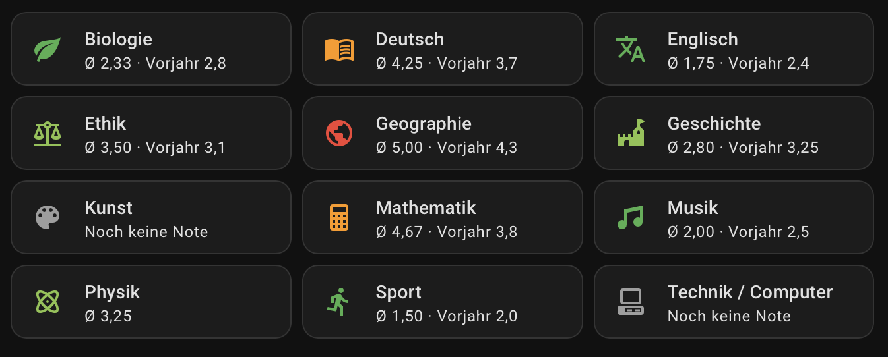

# beste.schule für Home Assistant

[](https://github.com/RF1705/beste-schule/actions/workflows/hacs.yml)
[](https://github.com/RF1705/beste-schule/actions/workflows/hassfest.yml)
[](https://github.com/RF1705/beste-schule/releases)
[](https://github.com/RF1705/beste-schule/releases)
[](LICENSE)
[](https://buymeacoffee.com/rf1705)

Home-Assistant-Integration für Stundenpläne, Fehlzeiten, Hausaufgaben, Klassenarbeiten, Schulhinweise, Schulzeit und Notendurchschnitte aus beste.schule.

Diese Custom Integration verbindet Home Assistant über einen Personal Access Token mit [beste.schule](https://beste.schule/). Sie erstellt Kalender für Unterricht, Fehlzeiten, Hausaufgaben, Klassenarbeiten und schulweite Hinweise, stellt den aktuellen Schulzeit-Status bereit und legt Notendurchschnitt-Sensoren für die einzelnen Fächer an.

## Funktionen

- Stundenplan-Kalender mit Unterricht aus beste.schule
- Stundenplan-Historie mit vergangenen Unterrichtsstunden ab dem Tag der Einrichtung
- Fehlzeiten-Kalender mit ganztägigen Abwesenheitseinträgen
- Hausaufgaben-Kalender aus sichtbaren Klassenbuch-Einträgen
- Klassenarbeiten-Kalender aus sichtbaren Klassenbuch-Einträgen
- Schulhinweise-Kalender für ganztägige Vertretungshinweise
- Hausaufgaben-To-do-Liste aus sichtbaren Klassenbuch-Einträgen
- Binary Sensor für die Schulzeit
- Sensoren für die aktuelle und die nächste Unterrichtsstunde
- Sensor für Krankheitstage
- Sensor für das aktuelle Schuljahr
- Notendurchschnitt-Sensoren pro Fach
- Notendurchschnitte verwenden die Berechnungsregeln und Gewichtungen aus beste.schule, sofern verfügbar
- Sensor für die Klasse
- Stundenplan-JSON-Sensor für `fabel-smith/stundenplan-card`
- Optionen zum Aktivieren oder Deaktivieren der Kalender und der Hausaufgaben-To-do-Liste
- Übersetzungen für Deutsch, Englisch, Türkisch, Polnisch und weitere gängige Home-Assistant-Sprachen
- Unterstützung für mehrere Kinder innerhalb eines beste.schule-Kontos

## Installation mit HACS

[](https://my.home-assistant.io/redirect/hacs_repository/?owner=RF1705&repository=beste-schule&category=integration)

1. Öffne den HACS-Link oben.
2. Bestätige, dass das Repository als Integration hinzugefügt wird.
3. Installiere `beste.schule` über HACS.
4. Starte Home Assistant neu.
5. Öffne **Einstellungen** -> **Geräte & Dienste** -> **Integration hinzufügen**.
6. Suche nach `beste.schule`.
7. Füge deinen beste.schule Personal Access Token ein.

## Manuelle Einrichtung des HACS-Repositories

Falls der Button nicht funktioniert:

1. Öffne Home Assistant.
2. Gehe zu **HACS** -> **Integrationen**.
3. Öffne das Drei-Punkte-Menü und wähle **Benutzerdefinierte Repositories**.
4. Füge dieses Repository hinzu:

   ```text
   https://github.com/RF1705/beste-schule
   ```

5. Wähle **Integration** als Kategorie.
6. Installiere `beste.schule`, starte Home Assistant neu und füge die Integration anschließend unter **Geräte & Dienste** hinzu.

## Personal Access Token

Erstelle einen Token in deinem beste.schule-Benutzerkonto:

1. Melde dich bei beste.schule an.
2. Öffne oben rechts über deinen Namen dein Benutzerkonto.
3. Wähle links **API**.
4. Erstelle unter **Personal Access Token** einen neuen Token.
5. Kopiere den Token und füge ihn beim Einrichten der Home-Assistant-Integration ein.

## Entitäten

Die Integration erstellt derzeit:

- `calendar`: Stundenplan
- `calendar`: Fehlzeiten
- `calendar`: Hausaufgaben
- `calendar`: Klassenarbeiten
- `calendar`: Hinweise
- `todo`: Hausaufgaben
- `binary_sensor`: Schulzeit
- `sensor`: aktuelle Unterrichtsstunde
- `sensor`: nächste Unterrichtsstunde
- `sensor`: Krankheitstage
- `sensor`: Klasse
- `sensor`: Schuljahr
- `sensor`: Stundenplan-Kartendaten
- `number`: Wochenoffset für kompatible Stundenplan-Karten
- `sensor`: Notendurchschnitt pro Fach

### Beispiel: Notenübersicht im Dashboard

Die Notendurchschnitt-Sensoren lassen sich mit
[Mushroom Cards](https://github.com/piitaya/lovelace-mushroom) als kompakte Übersicht im Dashboard darstellen.

Das folgende Beispiel zeigt für jedes Fach den aktuellen Durchschnitt und – sofern vorhanden – den Durchschnitt des vorherigen Schuljahres. Gab es ein Fach im vorherigen Schuljahr noch nicht, wird der Vorjahreswert automatisch weggelassen. Fächer ohne aktuelle Note werden als `Noch keine Note` angezeigt.




Für die Farben wird folgendes Schema verwendet:

- bis `2.5`: grün
- bis `3.5`: hellgrün
- unter `5.0`: orange
- ab `5.0`: rot
- keine aktuelle Note: grau

Die vollständige Dashboard-Konfiguration findest du unter
[`examples/grade-dashboard.yaml`](examples/grade-dashboard.yaml).

Das Beispiel-YAML verwendet `sensor.test_note_*` als Entity-IDs, da der Screenshot mit Test-Sensoren erstellt wurde. Ersetze diese IDs durch die von der Integration erzeugten Noten-Sensoren deines Kindes, zum Beispiel `sensor.<child>_note_ethik`.

Das vorherige Schuljahr wird aus dem entsprechenden Sensor-Attribut gelesen. Das Template prüft vor der Ausgabe, ob dieses Attribut vorhanden ist. Fächer, die erst im aktuellen Schuljahr hinzugekommen sind, benötigen deshalb keine Sonderbehandlung.

### Kompatibilität mit stundenplan-card

Die `0.4`-Versionen sind über die JSON-Quelle mit [`fabel-smith/stundenplan-card`](https://github.com/fabel-smith/stundenplan-card) kompatibel. Damit lässt sich der beste.schule-Stundenplan als kompakte Tabelle in einem Home-Assistant-Dashboard darstellen.

Für aktuelle Versionen der `stundenplan-card` sollte der Sensor über `rows_table` eingebunden werden. Nur dieses Attribut folgt dem ausgewählten Wochenversatz und liefert dadurch beim Blättern die Daten der gewählten Woche:

```yaml
type: custom:stundenplan-card
source_type: sensor
source_entity: sensor.<child>_stundenplan_card
source_attribute: rows_table
source_time_key: time
week_offset_entity: number.<child>_stundenplan_wochenversatz
```

Am einfachsten ist die Einrichtung über den visuellen Editor der Karte. Wähle dort den `Timetable card`-Sensor der Integration. Der Sensor stellt `rows_table`, Datumsinformationen und die passende `week_offset_entity` bereit. Die erzeugte `Timetable week offset`-Entität unterstützt die aktuelle sowie die nächsten zwei Wochen; die Pfeiltasten der Karte aktualisieren den Wert automatisch.

Das Attribut `plan` bleibt aus Kompatibilitätsgründen erhalten. Es ist eine Legacy-Ansicht für bestehende Dashboards und zeigt unabhängig vom eingestellten Wochenversatz die aktuelle Woche beziehungsweise am Wochenende die kommende Woche. Für die Wochen-Navigation darf daher nicht `source_attribute: plan`, sondern muss `source_attribute: rows_table` verwendet werden.

Bestehende Dashboards ohne Wochen-Navigation, die `source_type: sensor`, `plan` und `Stunde` verwenden, funktionieren unverändert weiter.

Alte Test-Entitäten aus frühen Versionen können nach einem Update in der Entity Registry von Home Assistant verbleiben. Wenn sie von der Integration nicht mehr bereitgestellt werden, können sie unter **Einstellungen** -> **Geräte & Dienste** -> **Entitäten** entfernt werden.

### Mehrere Kinder

Ab Version `0.6` kann ein beste.schule-Token getrennte Home-Assistant-Geräte für mehrere Kinder desselben Kontos erstellen. Jedes Kind erhält eigene Kalender, Sensoren und eine eigene Hausaufgaben-To-do-Liste.

## Roadmap

- Robustere Verarbeitung von Vertretungsdetails, sobald die API-Strukturen eindeutiger sind

## Support

Dieses Projekt wird von der Community gepflegt und steht in keiner Verbindung zu beste.schule.

Wenn dir die Integration hilft, kannst du die Entwicklung hier unterstützen: [buymeacoffee.com/rf1705](https://buymeacoffee.com/rf1705).

## Lizenz

MIT
